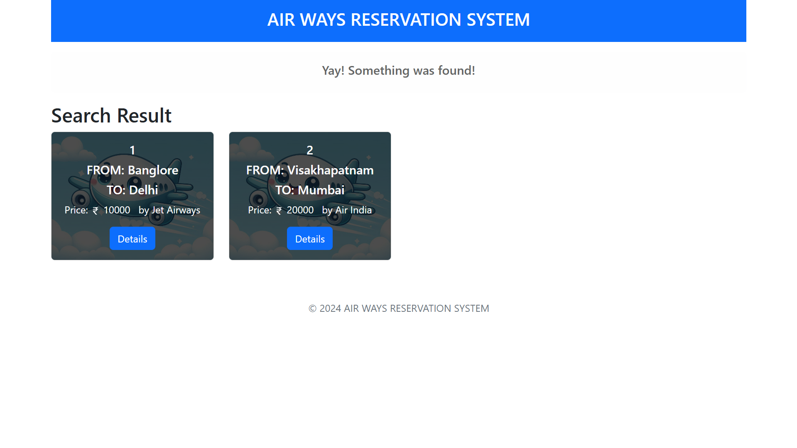
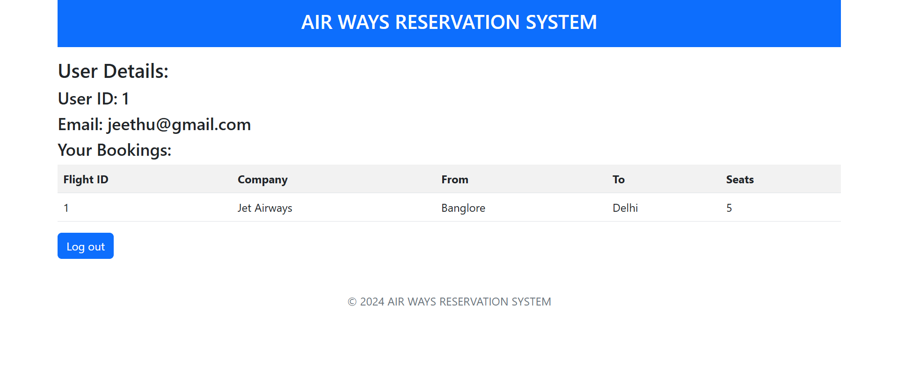
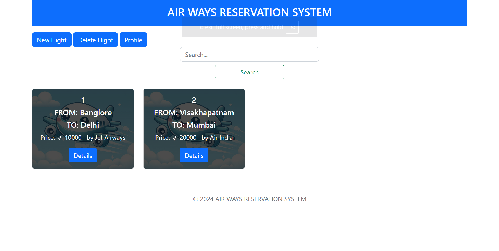

# Airways-reservation

Developed an Airways Reservation System to demonstrate CRUD operations using a relational database for managing flights, bookings, and users. It is structured into two main modules:

Admin: Manages flights.
User: Books flight tickets by selecting required flight and seats.

Each module consists of four key Python files:

init: Initializes objects for the module.
Models: Defines the database tables and relationships.
Forms: Contains form input validations.
Views: Manages routes and logic for the pages.


## Tech Stack

**Client:** \
• HTML5 \
• CSS3 \
• Bootstrap

**Server:** \
• Flask \
• Flask-WTF \
• Flask_SQLAlchemy \
• Werkzeug \
• Jinja2

**Database:** \
• SQLite

**Package Management:** \
• pip \
• requirements.txt

**Development Tools:** \
• Pycharm \
• SQLite


## Features

- Light/dark mode toggle
- Live previews
- Fullscreen mode
- Cross platform


## project is live [HERE](https://airways-reservation.onrender.com).

## Run Locally

Clone the project

```bash
  git clone https://github.com/yajath003/Airways-reservation.git
```

Go to the project directory

```bash
  cd Airways-reservation
```

Install dependencies

```bash
  pip install -r requirements.txt
```

Start the server

```bash
  python main.py
```


## Screenshots
**Intro page**\

**User dashboard**\


**User profile**\


**Admin dashboard**\


